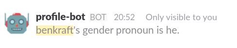

# slash-profile

Slack's custom profile fields are great!  But looking them up takes a while.  What if it were this easy?

This is the code that backs them all: `/github`, `/house`, `/pronoun`, and `/twitter`, currently.

## Configuration

To add a new slash-profile backed slack command:

1. Find the field ID.  The easiest way to do that is to use the [Slack API tester](https://api.slack.com/methods/users.profile.get/test), setting `include_labels` to `1`.  You want the path to the desired field, slash-separated, e.g. `email` or `fields/Xf0???????` for custom fields.
2. Add a Slack slash command, with your chosen name.  Point it at `POST https://slack-profile.appspot.com/<field path>`.  I like to set the name to `profile-bot` and the icon to `:robot_face:`, and add a help message and description.  Note down the token.
3. Add the token to the set `secrets.tokens`.  If you haven't already, add a slack API token as `secrets.slack_bot_token`.  Redeploy the app (see below).
4. ???
5. `:party_dino:`

## Dev & deploy

You'll need `gcloud` with the App Engine components installed, and the App Engine SDK.  To deploy, `make deploy`.  Ask @benkraft for access.
